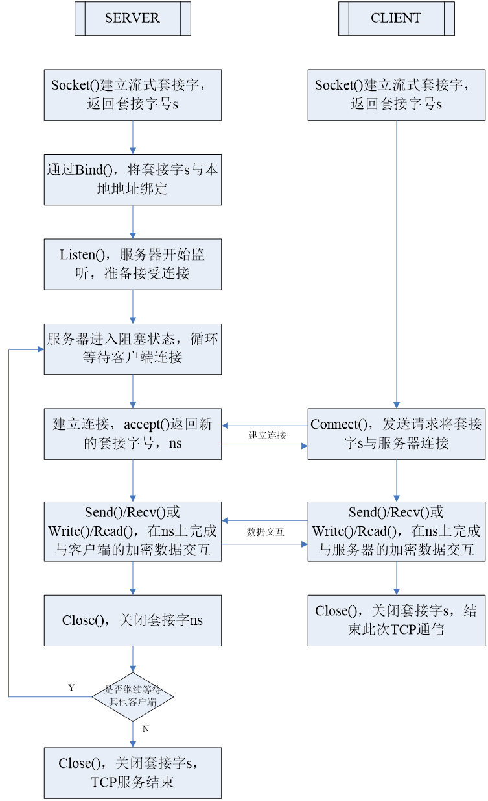
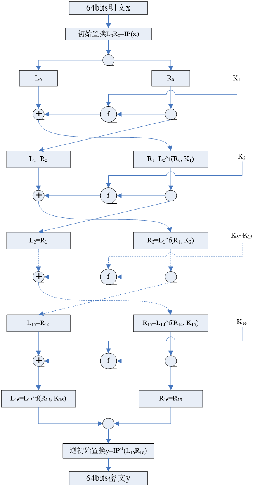
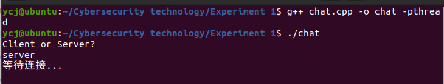
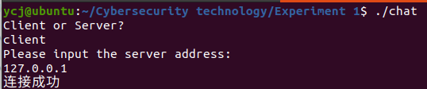
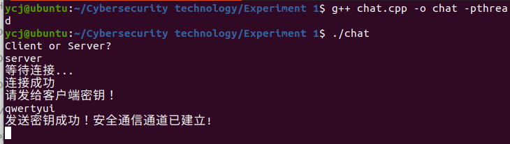
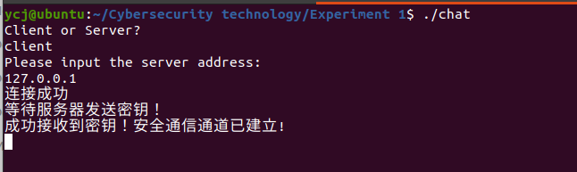
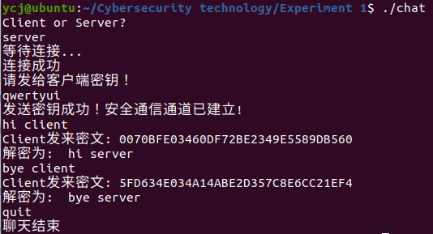
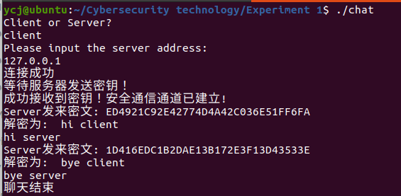

# 实验1：基于DES加密的TCP聊天程序


#### 学号：2112066

#### 姓名：于成俊

#### 专业：密码科学与技术


## 一、实验目的

DES（Data Encryption Standard）算法是一种用56位有效密钥来加密64位数据的对称分组加密算法，该算法流程清晰，已经得到了广泛的应用，算是应用密码学中较为基础的加密算法。TCP（传输控制协议）是一种面向链接的、可靠的传输层协议。TCP协议在网络层IP协议的基础上，向应用层用户进程提供可靠的、全双工的数据流传输。

本章训练的目的如下：

- 理解DES加解密原理。
- 理解TCP协议的工作原理。
- 掌握linux下基于socket的编程方法。

本章训练的要求如下：

- 利用socket编写一个TCP聊天程序。
- 通信内容经过DES加密与解密。


## 二、实验环境

- 系统：Ubuntu
- 编程语言：C++


## 三、实验原理

- TCP通信流程如下：

  

- DES加密流程图如下：

  

  解密流程与加密流程基本一致，仍为先进行初始置换，最后进行逆置换，中间16轮利用16个密钥的迭代加密，唯一不同的地方就是所生成的16个密钥的使用顺序，加密运算与解密运算的密钥使用顺序正好相反。


## 四、实验过程

### （1）其他函数

由于DES加密的是01字符串，而输入的是普通字符串，为了方便转化，定义了以下函数

```c++
// 定义一个函数将字符串转化为二进制形式并存储在int数组中
int* stringToBinary(const char* input, int& bits) {
    int length = strlen(input);
    int i, j;
    if ((length * 8) % 64 != 0) {
        bits = 64 + ((length * 8) / 64 * 64);
    }
    else {
        bits = length * 8;
    }
    int* binaryArray = (int*)malloc(bits * sizeof(int));
    for (i = 0; i < length; ++i) {
        // 获取当前字符的ASCII值
        int asciiValue = (int)input[i];
        // 将ASCII值转换为二进制形式并存储在int数组中
        for (j = 7; j >= 0; --j) {
            binaryArray[i * 8 + (7 - j)] = (asciiValue >> j) & 1;
        }
    }
    //用0补为64的倍数
    for (i = length * 8; i < bits; i++) {
        binaryArray[i] = 0;
    }
    return binaryArray;
}

// 将int数组中的二进制转换为十六进制字符串
char* binaryArrayToHexString(int binaryArray[], int length) {
    char* hexString = (char*)malloc((length / 4 + 1) * sizeof(char));
    int i, j;
    for (i = 0; i < length; i += 4) {
        int decValue = 0;
        for (j = 0; j < 4; ++j) {
            decValue = (decValue << 1) | binaryArray[i + j];
        }
        if (decValue >= 0 && decValue <= 9)
            hexString[i / 4] = (char)(decValue + '0');
        else
            hexString[i / 4] = (char)(decValue - 10 + 'A');
    }
    hexString[length / 4] = '\0';

    return hexString;
}
//将16进制字符串转化为int数组中的二进制
int* HexStringToBinaryArray(const char* HexString, int& bits) {
    int length = strlen(HexString);
    bits = length * 4;
    int* binaryArray = (int*)(malloc)(bits * sizeof(int));
    int decValue;
    for (int i = 0; i < length; i++) {
        if (HexString[i] <= 'F' && HexString[i] >= 'A') {
            decValue = (int)HexString[i] - 'A' + 10;
        }
        else {
            decValue = (int)HexString[i] - '0';
        }
        for (int j = 3; j >= 0; j--) {
            binaryArray[i * 4 + j] = decValue & 1;
            decValue >>= 1;
        }
    }
    return binaryArray;
}
//将二进制数组转化为字符串
char* BinaryToString(int* binary, int length) {
    char* output = (char*)malloc((length / 8 + 1) * sizeof(char));
    for (int i = 0; i < length / 8; i++) {
        int asciiValue = 0;
        for (int j = 0; j < 8; j++) {
            asciiValue = asciiValue << 1 | binary[i * 8 + j];
        }
        output[i] = (char)asciiValue;
    }
    output[length / 8 + 1] = '\0';
    return output;
}
```

### （2）DES部分

#### 1.IP置换

IP初始置换就是按照IP表对明文进行置换，代码如下：

```C++
// 初始置换表
const int IP_Table[64] = {
    58, 50, 42, 34, 26, 18, 10, 2, 60, 52, 44, 36, 28, 20, 12, 4,
    62, 54, 46, 38, 30, 22, 14, 6, 64, 56, 48, 40, 32, 24, 16, 8,
    57, 49, 41, 33, 25, 17, 9, 1, 59, 51, 43, 35, 27, 19, 11, 3,
    61, 53, 45, 37, 29, 21, 13, 5, 63, 55, 47, 39, 31, 23, 15, 7 };
//初始置换
int* initial_permutation(int* input) {
    int* output = (int*)malloc(64 * sizeof(int));
    for (int i = 0; i <= 63; i++) {
        output[i] = input[IP_Table[i] - 1];
    }
    return output;
}
```

#### 2.生成16轮子密钥

分为以下三个部分

- 首先，不考虑每个字节的第8位，DES的密钥由64位减至56位，每个字节的第8位作为奇偶校验位。产生的56位密钥由密钥置换表生成（注意该表中没有8,16,24，32,40,48,56和64这8位）

  ```c++
  //密钥置换表
  static int KeyReplace_Table[56] = {
      57, 49, 41, 33, 25, 17, 9, 1, 58, 50, 42, 34, 26, 18,
      10, 2, 59, 51, 43, 35, 27, 19, 11, 3, 60, 52, 44, 36,
      63, 55, 47, 39, 31, 23, 15, 7, 62, 54, 46, 38, 30, 22,
      14, 6, 61, 53, 45, 37, 29, 21, 13, 5, 28, 20, 12, 4 };
  ```

- 其次，在DES的每一轮中，从56位密钥产生出不同的48位子密钥，确定这些子密钥的方式如下：

  - 将56位的密钥分成两部分，每部分28位。
  - 根据轮数，这两部分分别循环左移1位或2位，注意，是根据上一轮的结果进行左移，每轮移动的位数由密钥移位表决定

  ```c++
  //密钥移位表
  static int Move_Table[16] = {
      1, 1, 2, 2, 2, 2, 2, 2, 1, 2, 2, 2, 2, 2, 2, 1 };
  ```

- 最后，从56位中选出48位。这个过程中，既置换了每位的顺序，又选择了子密钥，因此称为压缩置换。压缩置换规则由密钥压缩置换表决定

  ```C++
  //密钥压缩置换表
  static int Compress_Table[48] = {
      14, 17, 11, 24, 1, 5, 3, 28, 15, 6, 21, 10,
      23, 19, 12, 4, 26, 8, 16, 7, 27, 20, 13, 2,
      41, 52, 31, 37, 47, 55, 30, 40, 51, 45, 33, 48,
      44, 49, 39, 56, 34, 53, 46, 42, 50, 36, 29, 32 };
  ```

生成子密钥函数如下：

```C++
// 生成子密钥函数
void Getsubkey(int* input, int subkey[][48]) {

    int temp[56];
    for (int i = 0; i <= 55; i++) {
        temp[i] = input[KeyReplace_Table[i] - 1];
    }
    //分为左右两部分
    int left[17][28];      // 左半部分，28位
    int right[17][28]; // 右半部分，28位

    // 将高28位存入 left，低28位存入 right
    for (int i = 0; i <= 27; i++) {
        left[0][i] = temp[i];
        right[0][i] = temp[i + 28];
    }

    //产生子密钥
    for (int i = 0; i <= 15; i++) {
        for (int j = 0; j <= 27; j++) {
            left[i + 1][j] = left[i][(j + Move_Table[i]) % 28];
            right[i + 1][j] = right[i][(j + Move_Table[i]) % 28];
        }
        for (int j = 0; j <= 47; j++) {
            if (Compress_Table[j] <= 28) {
                subkey[i][j] = left[i + 1][Compress_Table[j] - 1];
            }
            else {
                subkey[i][j] = right[i + 1][Compress_Table[j] - 29];
            }
        }
    }

}
```

#### 3.E扩展置换

扩展置置换目标是将IP置换后获得的右半部分R0由32位输入扩展为48位(分为4位×8组)输出。扩展置换规则由E扩展置换表决定，代码如下：

```C++
// E扩展置换表
static int Expansion_Table[48] = {
    32, 1, 2, 3, 4, 5, 4, 5, 6, 7, 8, 9,
    8, 9, 10, 11, 12, 13, 12, 13, 14, 15, 16, 17,
    16, 17, 18, 19, 20, 21, 20, 21, 22, 23, 24, 25,
    24, 25, 26, 27, 28, 29, 28, 29, 30, 31, 32, 1 };
// E扩展置换函数
int* expansion_permutation(int* input) {
    int* output = (int*)malloc(48 * sizeof(int));
    for (int i = 0; i <= 47; i++) {
        output[i] = input[Expansion_Table[i] - 1];
    }
    return output;
}
```

#### 4.S盒代替

压缩后的密钥与扩展分组异或以后得到48位的数据，将这个数据送入S盒，进行替代运算。替代由8个不同的S盒完成，每个S盒有6位输入4位输出。48位输入分为8个6位的分组，一个分组对应一个S盒，对应的S盒对各组进行代替操作。代替过程产生8个4位的分组，组合在一起形成32位数据。代码如下：

```C++
//S盒
static int S_Box[8][4][16] = {
    //S1
    14, 4, 13, 1, 2, 15, 11, 8, 3, 10, 6, 12, 5, 9, 0, 7,
    0, 15, 7, 4, 14, 2, 13, 1, 10, 6, 12, 11, 9, 5, 3, 8,
    4, 1, 14, 8, 13, 6, 2, 11, 15, 12, 9, 7, 3, 10, 5, 0,
    15, 12, 8, 2, 4, 9, 1, 7, 5, 11, 3, 14, 10, 0, 6, 13,
    //S2
    15, 1, 8, 14, 6, 11, 3, 4, 9, 7, 2, 13, 12, 0, 5, 10,
    3, 13, 4, 7, 15, 2, 8, 14, 12, 0, 1, 10, 6, 9, 11, 5,
    0, 14, 7, 11, 10, 4, 13, 1, 5, 8, 12, 6, 9, 3, 2, 15,
    13, 8, 10, 1, 3, 15, 4, 2, 11, 6, 7, 12, 0, 5, 14, 9,
    //S3
    10, 0, 9, 14, 6, 3, 15, 5, 1, 13, 12, 7, 11, 4, 2, 8,
    13, 7, 0, 9, 3, 4, 6, 10, 2, 8, 5, 14, 12, 11, 15, 1,
    13, 6, 4, 9, 8, 15, 3, 0, 11, 1, 2, 12, 5, 10, 14, 7,
    1, 10, 13, 0, 6, 9, 8, 7, 4, 15, 14, 3, 11, 5, 2, 12,
    //S4
    7, 13, 14, 3, 0, 6, 9, 10, 1, 2, 8, 5, 11, 12, 4, 15,
    13, 8, 11, 5, 6, 15, 0, 3, 4, 7, 2, 12, 1, 10, 14, 9,
    10, 6, 9, 0, 12, 11, 7, 13, 15, 1, 3, 14, 5, 2, 8, 4,
    3, 15, 0, 6, 10, 1, 13, 8, 9, 4, 5, 11, 12, 7, 2, 14,
    //S5
    2, 12, 4, 1, 7, 10, 11, 6, 8, 5, 3, 15, 13, 0, 14, 9,
    14, 11, 2, 12, 4, 7, 13, 1, 5, 0, 15, 10, 3, 9, 8, 6,
    4, 2, 1, 11, 10, 13, 7, 8, 15, 9, 12, 5, 6, 3, 0, 14,
    11, 8, 12, 7, 1, 14, 2, 13, 6, 15, 0, 9, 10, 4, 5, 3,
    //S6
    12, 1, 10, 15, 9, 2, 6, 8, 0, 13, 3, 4, 14, 7, 5, 11,
    10, 15, 4, 2, 7, 12, 0, 5, 6, 1, 13, 14, 0, 11, 3, 8,
    9, 14, 15, 5, 2, 8, 12, 3, 7, 0, 4, 10, 1, 13, 11, 6,
    4, 3, 2, 12, 9, 5, 15, 10, 11, 14, 1, 7, 6, 0, 8, 13,
    //S7
    4, 11, 2, 14, 15, 0, 8, 13, 3, 12, 9, 7, 5, 10, 6, 1,
    13, 0, 11, 7, 4, 0, 1, 10, 14, 3, 5, 12, 2, 15, 8, 6,
    1, 4, 11, 13, 12, 3, 7, 14, 10, 15, 6, 8, 0, 5, 9, 2,
    6, 11, 13, 8, 1, 4, 10, 7, 9, 5, 0, 15, 14, 2, 3, 12,
    //S8
    13, 2, 8, 4, 6, 15, 11, 1, 10, 9, 3, 14, 5, 0, 12, 7,
    1, 15, 13, 8, 10, 3, 7, 4, 12, 5, 6, 11, 0, 14, 9, 2,
    7, 11, 4, 1, 9, 12, 14, 2, 0, 6, 10, 13, 15, 3, 5, 8,
    2, 1, 14, 7, 4, 10, 8, 13, 15, 12, 9, 0, 3, 5, 6, 11 };
//S盒变换 将48位的处理结果压缩成32位
int* S_Change(int* input) {
    int* output = (int*)malloc(32 * sizeof(int));
    int X, Y;
    for (int i = 0; i < 8; i++) {
        Y = (input[i * 6 + 0] << 1) + input[i * 6 + 5];     //1和6位决定行数
        X = (input[i * 6 + 1] << 3) + (input[i * 6 + 2] << 2) + (input[i * 6 + 3] << 1) + input[i * 6 + 4]; //2345决定列数
        int temp = S_Box[i][Y][X];
        for (int j = 3; j >= 0; j--) {
            output[j + i * 4] = temp & 1;
            temp >>= 1;
        }
    }
    return output;
}
```

#### 5.P盒置换

S盒代替运算的32位输出按照P盒进行置换。该置换把输入的每位映射到输出位，任何一位不能被映射两次，也不能被略去，映射规则由P盒置换表决定，代码如下：

```c++
//P盒置换表
static int P_Box[32] = {
    16, 7, 20, 21, 29, 12, 28, 17, 1, 15, 23, 26, 5, 18, 31, 10,
    2, 8, 24, 14, 32, 27, 3, 9, 19, 13, 30, 6, 22, 11, 4, 25 };
// P盒置换函数
int* p_box_permutation(int* input) {
    int* output = (int*)malloc(32 * sizeof(int));
    for (int i = 0; i <= 31; i++) {
        output[i] = input[P_Box[i] - 1];
    }
    return output;
}
```

#### 6.$IP^{-1}$末置换

末置换是初始置换的逆过程，DES最后一轮后，左、右两半部分并未进行交换，而是两部分合并形成一个分组做为末置换的输入。末置换规则由逆初始置换表决定

```C++
// 逆初始置换表
const int Inverse_IP_Table[64] = {
    40, 8, 48, 16, 56, 24, 64, 32, 39, 7, 47, 15, 55, 23, 63, 31,
    38, 6, 46, 14, 54, 22, 62, 30, 37, 5, 45, 13, 53, 21, 61, 29,
    36, 4, 44, 12, 52, 20, 60, 28, 35, 3, 43, 11, 51, 19, 59, 27,
    34, 2, 42, 10, 50, 18, 58, 26, 33, 1, 41, 9, 49, 17, 57, 25 };
// IP-1末置换函数
int* final_permutation(int* input) {
    int* output = (int*)malloc(64 * sizeof(int));
    for (int i = 0; i <= 63; i++) {
        output[i] = input[Inverse_IP_Table[i] - 1];
    }
    return output;
}
```

#### 7.加密和解密函数

根据DES流程图，并综合以上各个模块，编写加密和解密函数，其中，只有子密钥顺序不同，其余部分均相同。代码如下：

```C++
//加密
int* DES_ENC(int* plaintext, char* key) {
    //生成子密钥
    int subkey[16][48];
    int key_length;
    int* key_bits;
    key_bits = stringToBinary(KEY, key_length);
    Getsubkey(key_bits, subkey);
    //IP置换
    int* IP_result = initial_permutation(plaintext);
    int right[32];
    int left[32];
    for (int i = 0; i <= 31; i++) {
        left[i] = IP_result[i];
        right[i] = IP_result[i + 32];
    }
    int* right_extend = NULL;
    int key_result[48];
    int* S_result = NULL;
    int* P_result = NULL;
    int temp[32];
    //16轮迭代加密
    for (int i = 0; i <= 15; i++) {
        //E扩展
        right_extend = expansion_permutation(right);
        //与密钥进行异或
        for (int j = 0; j <= 47; j++) {
            right_extend[j] = right_extend[j] ^ subkey[i][j];
        }
        //S盒变换
        S_result = S_Change(right_extend);
        //P置换
        P_result = p_box_permutation(S_result);
        //保存R0
        for (int j = 0; j <= 31; j++) {
            temp[j] = right[j];
        }
        //进行异或
        for (int j = 0; j <= 31; j++) {
            right[j] = left[j] ^ P_result[j];
        }
        //更新L
        for (int j = 0; j <= 31; j++) {
            left[j] = temp[j];
        }
    }
    int temp_result[64];
    for (int i = 0; i <= 31; i++) {

        temp_result[i] = right[i];

    }
    for (int i = 32; i <= 63; i++) {

        temp_result[i] = left[i - 32];

    }
    int* ciphertext = final_permutation(temp_result);
    return ciphertext;
}


//解密
int* DES_DEC(int* ciphertext, char* key) {
    //生成子密钥
    int subkey[16][48];
    int key_length;
    int* key_bits;
    key_bits = stringToBinary(KEY, key_length);
    Getsubkey(key_bits, subkey);
    //IP置换
    int* IP_result = initial_permutation(ciphertext);
    int right[32];
    int left[32];
    for (int i = 0; i <= 31; i++) {
        left[i] = IP_result[i];
        right[i] = IP_result[i + 32];
    }
    int* right_extend = NULL;
    int key_result[48];
    int* S_result = NULL;
    int* P_result = NULL;
    int temp[32];
    //16轮迭代加密
    for (int i = 0; i <= 15; i++) {
        //E扩展
        right_extend = expansion_permutation(right);
        //与密钥进行异或
        for (int j = 0; j <= 47; j++) {
            right_extend[j] = right_extend[j] ^ subkey[15 - i][j];
        }
        //S盒变换
        S_result = S_Change(right_extend);
        //P置换
        P_result = p_box_permutation(S_result);
        //保存R0
        for (int j = 0; j <= 31; j++) {
            temp[j] = right[j];
        }
        //进行异或
        for (int j = 0; j <= 31; j++) {
            right[j] = left[j] ^ P_result[j];
        }
        //更新L
        for (int j = 0; j <= 31; j++) {
            left[j] = temp[j];
        }
    }
    int temp_result[64];
    for (int i = 0; i <= 31; i++) {

        temp_result[i] = right[i];

    }
    for (int i = 32; i <= 63; i++) {

        temp_result[i] = left[i - 32];

    }
    int* plaintext = final_permutation(temp_result);
    return plaintext;
}
```

### （3）TCP通信部分

- 为了实现全双工通信我们需要用到线程，定义两个接受信息的函数，分别为客户端和服务器的，代码如下：

  ```C++
  //客户端接收消息
  void* client_recv_message(void* arg) {
      int client_sock = *((int*)arg);
      char recv_buf[BUF_SIZE];
      bool first = true;
      while (1) {
          int recv_len = recv(client_sock, recv_buf, sizeof(recv_buf), 0);
          if (recv_len < 0) {
              printf("Connection closed by the server.\n");
              break;
          }
          if (recv_len > 0) {
              recv_buf[strcspn(recv_buf, "\n")] = '\0'; //去除换行符
              if(strcmp(recv_buf,"quit")==0){
                  printf("%s\n","聊天结束");
                  exit(0);
              }
              if (first) {
                  strcpy(KEY, recv_buf);
                  first = false;
                  printf("%s\n", "成功接收到密钥！安全通信通道已建立!");
              }
              else {
                  printf("Server发来密文: %s\n", recv_buf);
                  int len;
                  int* ciphertext = HexStringToBinaryArray(recv_buf, len);
                  int temp[64];
                  int* plaintext = NULL;
                  char message[BUF_SIZE];
                  printf("解密为:  ");
                  for (int i = 0; i < len / 64; i++) {
                      for (int j = 0; j <= 63; j++) {
                          temp[j] = ciphertext[j + i * 64];
                      }
                      plaintext = DES_DEC(temp, KEY);
                      if (i == 0) {
                          strcpy(message, BinaryToString(plaintext, 64));
                      }
                      else {
                          strcat(message, BinaryToString(plaintext, 64));
                      }
                  }
                  printf("%s", message);
              }
          }
      }
      close(client_sock);
      exit(0);
  }
  
  //服务器端接收消息
  void* server_recv_message(void* arg) {
      int client_sock = *((int*)arg);
      char recv_buf[BUF_SIZE];
      while (1) {
          int recv_len = recv(client_sock, recv_buf, sizeof(recv_buf), 0);
          if (recv_len < 0) {
              printf("Connection closed by the client.\n");
              break;
          }
          if (recv_len > 0) {
              recv_buf[strcspn(recv_buf, "\n")] = '\0'; //去除换行符
              if(strcmp(recv_buf,"quit")==0){
                  printf("%s\n","聊天结束");
                  exit(0);
              }
              printf("Client发来密文: %s\n", recv_buf);
              int len;
              int* ciphertext = HexStringToBinaryArray(recv_buf, len);
              int temp[64];
              int* plaintext = NULL;
              char message[BUF_SIZE];
              printf("解密为:  ");
              for (int i = 0; i < len / 64; i++) {
                  for (int j = 0; j <= 63; j++) {
                      temp[j] = ciphertext[j + i * 64];
                  }
                  plaintext = DES_DEC(temp, KEY);
                  if (i == 0) {
                      strcpy(message, BinaryToString(plaintext, 64));
                  }
                  else {
                      strcat(message, BinaryToString(plaintext, 64));
                  }
              }
              printf("%s", message);
  
          }
      }
      close(client_sock);
      exit(0);
  }
  ```

- 按照实验原理中TCP通信流程图，进行编程，main函数如下：

  ```C++
  int main() {
  
      char type[8];
      printf("%s\n", "Client or Server?");// 从用户输入中读取一行字符串并赋值给字符数组
      fgets(type, sizeof(type), stdin);
      type[strcspn(type, "\n")] = '\0'; // 去除换行符
  
  
      //客户端程序
      if (strcmp(type, "client") == 0) {
  
          printf("%s\n", "Please input the server address:");
          char SERVER_IP[16];
          fgets(SERVER_IP, sizeof(SERVER_IP), stdin);
          SERVER_IP[strcspn(SERVER_IP, "\n")] = '\0'; // 去除换行符
          int client_socket;
          struct sockaddr_in server_address;
          char buffer[BUF_SIZE] = { 0 };
          pthread_t recv_thread;
  
          // 创建客户端套接字
          if ((client_socket = socket(AF_INET, SOCK_STREAM, 0)) < 0) {
              perror("套接字创建失败");
              exit(EXIT_FAILURE);
          }
  
          // 设置服务器地址
          server_address.sin_family = AF_INET;
          server_address.sin_port = htons(PORT);
  
          // 转换 IP 地址从文本到二进制
          if (inet_pton(AF_INET, SERVER_IP, &server_address.sin_addr) <= 0) {
              perror("转换 IP 地址失败");
              exit(EXIT_FAILURE);
          }
  
          // 连接到服务器
          if (connect(client_socket, (struct sockaddr*)&server_address, sizeof(server_address)) < 0) {
              perror("连接失败");
              exit(EXIT_FAILURE);
          }
  
          printf("连接成功\n");
          // 创建接收消息的线程
          if (pthread_create(&recv_thread, NULL, client_recv_message, (void*)&client_socket) != 0) {
              perror("thread creation failed");
              exit(EXIT_FAILURE);
          }
  
          printf("等待服务器发送密钥！\n");
          while (1) {
              // 发送消息到服务器
              fgets(buffer, BUF_SIZE, stdin);
              if(strcmp(buffer,"quit\n")==0){
                  send(client_socket, buffer, strlen(buffer), 0);
                  printf("%s\n","聊天结束");
                  exit(0);
              }
              int len;
              int* plaintext = stringToBinary(buffer, len);
              int temp[64];
              int* ciphertext = NULL;
              char message[BUF_SIZE];
              for (int i = 0; i < len / 64; i++) {
                  for (int j = 0; j <= 63; j++) {
                      temp[j] = plaintext[j + i * 64];
                  }
                  ciphertext = DES_ENC(temp, KEY);
                  if (i == 0) {
                      strcpy(message, binaryArrayToHexString(ciphertext, 64));
                  }
                  else {
                      strcat(message, binaryArrayToHexString(ciphertext, 64));
                  }
              }
              send(client_socket, message, strlen(message), 0);
          }
  
      }
  
      //服务器端程序
      if (strcmp(type, "server") == 0) {
  
  
          int server_socket, client_socket;
          struct sockaddr_in server_address, client_address;
          char buffer[BUF_SIZE] = { 0 };
          pthread_t recv_thread;
  
          // 创建服务器套接字
          if ((server_socket = socket(AF_INET, SOCK_STREAM, 0)) == 0) {
              perror("套接字创建失败");
              exit(EXIT_FAILURE);
          }
  
          // 设置服务器地址
          server_address.sin_family = AF_INET;
          server_address.sin_addr.s_addr = INADDR_ANY;
          server_address.sin_port = htons(PORT);
  
          // 绑定套接字到服务器地址
          if (bind(server_socket, (struct sockaddr*)&server_address, sizeof(server_address)) < 0) {
              perror("绑定失败");
              exit(EXIT_FAILURE);
          }
  
          // 监听套接字
          if (listen(server_socket, 3) < 0) {
              perror("监听失败");
              exit(EXIT_FAILURE);
          }
  
          printf("等待连接...\n");
          int client_address_len = sizeof(client_address);
  
          // 接受客户端连接
          if ((client_socket = accept(server_socket, (struct sockaddr*)&client_address, (socklen_t*)&client_address_len)) < 0) {
              perror("连接失败");
              exit(EXIT_FAILURE);
          }
  
          printf("连接成功\n");
          printf("请发给客户端密钥！\n");
          // 创建接收消息的线程
          if (pthread_create(&recv_thread, NULL, server_recv_message, (void*)&client_socket) != 0) {
              perror("thread creation failed");
              exit(EXIT_FAILURE);
          }
          bool first = true;
          while (1) {
              // 发送消息到客户端
              fgets(buffer, BUF_SIZE, stdin);
              if(strcmp(buffer,"quit\n")==0){
                  send(client_socket, buffer, strlen(buffer), 0);
                  printf("%s\n","聊天结束");
                  exit(0);
              }
              if (first) {
                  first = false;
                  send(client_socket, buffer, strlen(buffer), 0);
                  buffer[strcspn(buffer, "\n")] = '\0'; // 去除换行符
                  strcpy(KEY, buffer);
                  printf("%s\n", "发送密钥成功！安全通信通道已建立!");
              }
              else {
                  int len;
                  int* plaintext = stringToBinary(buffer, len);
                  int temp[64];
                  int* ciphertext = NULL;
                  char message[BUF_SIZE];
                  for (int i = 0; i < len / 64; i++) {
                      for (int j = 0; j <= 63; j++) {
                          temp[j] = plaintext[j + i * 64];
                      }
                      ciphertext = DES_ENC(temp, KEY);
                      if (i == 0) {
                          strcpy(message, binaryArrayToHexString(ciphertext, 64));
                      }
                      else {
                          strcat(message, binaryArrayToHexString(ciphertext, 64));
                      }
                  }
                  send(client_socket, message, strlen(message), 0);
  
              }
          }
  
  
      }
      return 0;
  }
  ```


## 五、实验结果展示

- 使用命令`g++ chat.cpp -o chat -pthread`进行编译，使用命令`./chat`运行程序

  

- 然后打开另一个控制台终端，再次运行可执行程序，选择客户端，并输入服务端的IP地址，即127.0.0.1

  

- 服务器端需要先将密钥KEY发送给客户端，才能进行通信

  - 服务端界面：

    

  - 客户端界面：

    

- 聊天画面如下，聊天过程中，任何一方输入“quit”，都可以关闭此连接，结束聊天。

  - 服务器：

    

  - 客户端：

    

    


## 六 实验总结

- `fgets(buffer, BUF_SIZE, stdin);`该函数会将回车也存入buffer中，所以要小心，以免忽略回车的存在，而出现各种错误，可以使用`buffer[strcspn(buffer, "\n")] = '\0';` 将换行符去掉
- 本次实验，让我将密码学课程的知识和计算机网络知识融合在了一起，让我对两门课程有了更深刻的理解。

