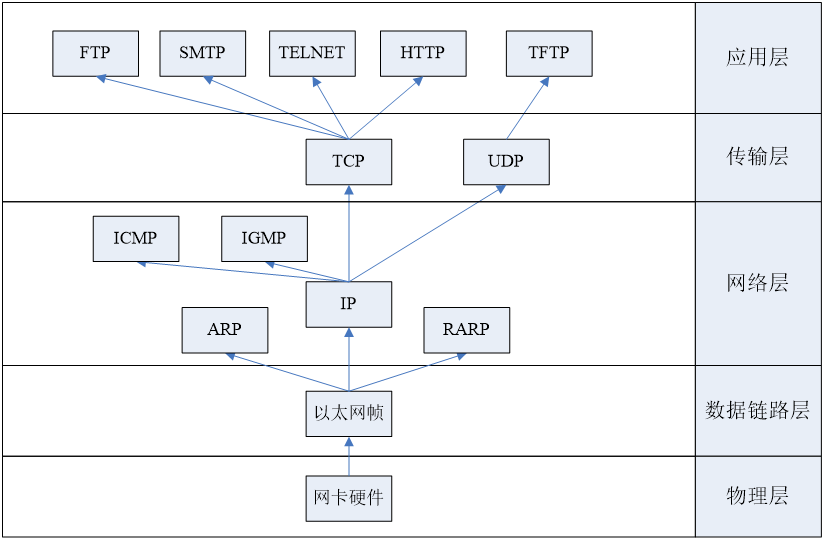
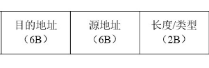
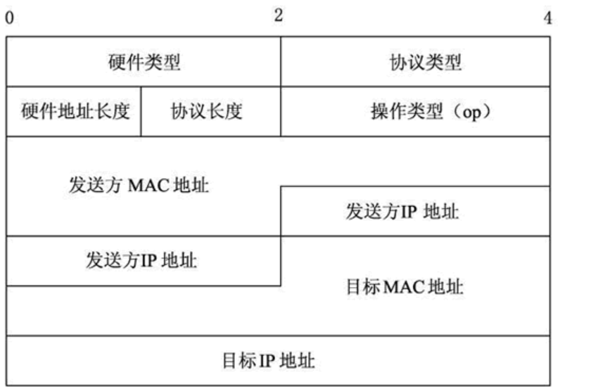
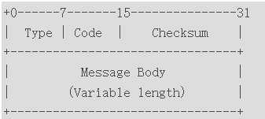
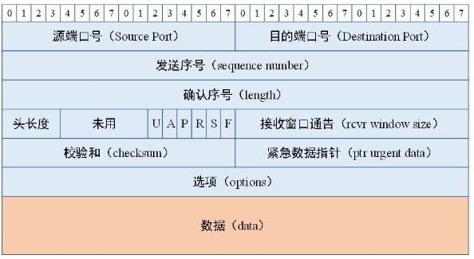
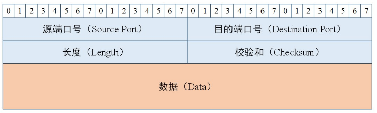
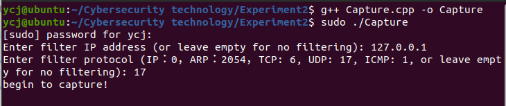
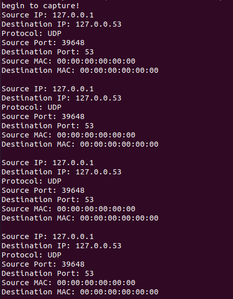
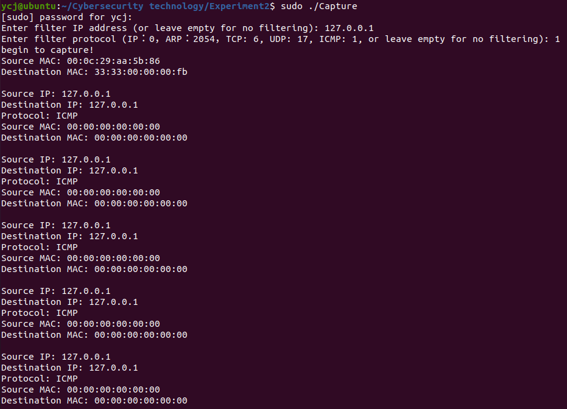
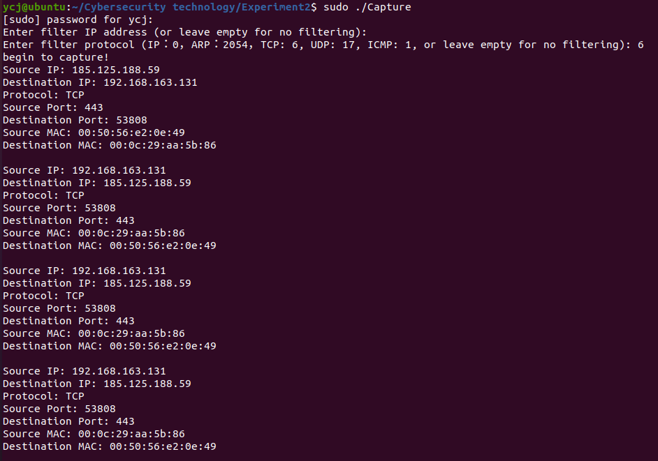

# 实验2：基于Raw Socket的Sniffer实现


#### 学号：2112066

#### 姓名：于成俊

#### 专业：密码科学与技术


## 一、实验目的和要求

- 网络监控软件能够监控网络流量，发现网络中异常的数据流，从而帮助系统及时而有效地发现和防御网络攻击。随着互联网的快速普及和发展以及网络攻击行为的频繁出现，保证网络的安全运行成为网络监控软件的一个重要目的。除此之外，网络监控也是黑客常用的手段。因此，网络监控技术是网络安全的基本技术之一，对维护网络的安全性具有重要作用。

- 本章的训练目的：

  ① 理解网络监控技术的基本原理。

  ② 理解（TCP/IP）网络层次结构。

  ③ 掌握Raw Socket的基本原理。

  ④ 熟练掌握TCP/IP、ICMP等协议以及socket编程技术相关背景知识。

- 本章训练要求：

  ① 利用原始套接字编写一个网络嗅探器捕获网络数据报。

  ② 分析基本的数据报信息。

  ③ 实现简单的过滤器功能。


## 二、实验内容

利用原始套接字编写一个网络嗅探器捕获网络数据报并且分析基本的数据报信息，例如IP地址、端口号、协议类型、物理地址等。另外要求实现简单的过滤器功能，能够捕获指定的数据报，例如捕获指定IP地址、指定协议的数据报等。


## 三、实验原理

### （1）原始套接字

在Linux下，原始套接字（Raw Socket）是一种特殊类型的套接字，它允许应用程序直接访问网络协议栈，而不经过操作系统提供的网络协议处理。使用原始套接字，应用程序可以创建自己的网络帧，并且可以构造自定义的网络包，以便实现更底层的网络功能。

原始套接字提供了以下主要功能和用途：

- **网络嗅探**：原始套接字允许应用程序捕获网络数据包，从而实现网络嗅探功能。通过监听网络流量，可以分析网络数据包的内容，监视网络活动以及诊断网络问题。

- **网络分析与调试**：通过捕获和分析网络数据包，可以进行网络调试和分析工作。可以检查数据包的内容、源地址、目标地址、协议类型等信息，帮助诊断网络问题和分析网络性能。

- **网络安全**：原始套接字可以用于实现网络安全功能，如防火墙、入侵检测系统（IDS）、网络流量监控等。通过监视网络流量并过滤或阻止恶意数据包，可以提高网络安全性。

- **网络数据包生成**：应用程序可以使用原始套接字创建和发送自定义的网络数据包。这对于实现网络协议栈的测试和开发非常有用，也可以用于实现一些特定的网络功能。

- **网络攻击和欺骗**：尽管有一定风险，但原始套接字也可被用于进行网络攻击和欺骗。通过伪造网络数据包，攻击者可以进行各种类型的攻击，如拒绝服务攻击（DoS）、欺骗攻击等。

在使用原始套接字时需要注意以下几点：

- **需要特权**：创建原始套接字通常需要特权，因为它可以绕过操作系统的网络协议栈，直接操作底层的网络设备。在Linux中，通常需要以root权限或者具有特定权限的用户才能创建原始套接字。

- **需要谨慎处理**：使用原始套接字需要谨慎处理，因为它可以绕过操作系统的网络协议栈，可能对系统造成安全风险和性能影响。在使用原始套接字时，应该遵循安全最佳实践，并且仔细测试和验证代码，以确保安全性和稳定性。

### （2）TCP/IP协议栈模型

TCP/IP协议栈模型并没有对主机-网络层做具体的定义。为使网络层次结构更加清晰，通常都对主机-网络层再做一个划分，分为物理层和数据链路层。这样用五层网络体系结构即物理层、数据链路层、网络层、传输层和应用层作为分层的标准。如下图：



### （3）数据包格式

- 帧首部

  

- ARP报文

  

- IP头部

  

- ICMP头部

  

- TCP数据单元段格式

  

- UDP报文

  

## 四、实验环境

- 系统：Ubuntu
- 编程语言：C++


## 五、实验代码

### （1）宏定义

```c++
#define BUFFER_SIZE 65536
#define ARP_HEADER_LEN 8
```

- 在网络编程中，65536 通常用作缓冲区大小的默认值。这是因为在大多数情况下，网络数据包的最大长度（MTU）为 1500 字节左右，而且 TCP/IP 协议栈在传输数据时会进行分段（segmentation）处理。因此，缓冲区大小通常被设置为一个较大的值，以确保能够容纳大多数网络数据包，并提高网络传输的效率。
- ARP头部长度是8字节

### （2）处理捕获数据包的函数

```C++
// 处理捕获的数据包
void process_packet(unsigned char* buffer, int size, const string& filter_ip, int filter_protocol) {
    // 解析以太网头部
    ethhdr* eth_header = (ethhdr*)buffer;
    uint16_t ethertype = ntohs(eth_header->h_proto);
    // IP报文
    if (ethertype == ETH_P_IP && filter_protocol != 2054) {
        // 解析IP头部
        iphdr* ip_header = (iphdr*)(buffer + sizeof(ethhdr));
        sockaddr_in source, dest;

        // 获取源IP地址和目的IP地址
        memset(&source, 0, sizeof(source));
        source.sin_addr.s_addr = ip_header->saddr;

        memset(&dest, 0, sizeof(dest));
        dest.sin_addr.s_addr = ip_header->daddr;

        // 判断是否过滤指定IP地址
        if (!filter_ip.empty() && filter_ip != inet_ntoa(source.sin_addr) && filter_ip != inet_ntoa(dest.sin_addr))
            return;

        // 判断是否过滤指定协议类型
        if (filter_protocol != -1 && ip_header->protocol != filter_protocol)
            return;

        // 打印源IP地址和目的IP地址
        cout << "Source IP: " << inet_ntoa(source.sin_addr) << endl;
        cout << "Destination IP: " << inet_ntoa(dest.sin_addr) << endl;

        // 判断协议类型并输出
        switch (ip_header->protocol) {
            tcphdr* tcp_header;
            udphdr* udp_header;
        case IPPROTO_TCP:
            cout << "Protocol: TCP" << endl;
            // 解析TCP头部
            tcp_header = (tcphdr*)(buffer + sizeof(ethhdr) + sizeof(iphdr));
            cout << "Source Port: " << ntohs(tcp_header->source) << endl;
            cout << "Destination Port: " << ntohs(tcp_header->dest) << endl;
            break;
        case IPPROTO_UDP:
            cout << "Protocol: UDP" << endl;
            // 解析UDP头部
            udp_header = (udphdr*)(buffer + sizeof(ethhdr) + sizeof(iphdr));
            cout << "Source Port: " << ntohs(udp_header->source) << endl;
            cout << "Destination Port: " << ntohs(udp_header->dest) << endl;
            break;
        case IPPROTO_ICMP:
            cout << "Protocol: ICMP" << endl;

            break;

        }
    }
    // ARP报文
    if (ethertype == ETH_P_ARP && filter_protocol != 0) {
        cout << "Protocol: ARP" << endl;
        // 解析ARP头部
        arphdr* arp_header = (arphdr*)(buffer + sizeof(ethhdr));


        // 源 IP 地址的偏移量
        int src_ip_offset = ARP_HEADER_LEN + 6;
        // 目标 IP 地址的偏移量
        int dst_ip_offset = ARP_HEADER_LEN + 16;

        // 提取源 IP 地址
        char src_ip_str[INET_ADDRSTRLEN];
        struct in_addr src_ip;
        memcpy(&src_ip, arp_header + src_ip_offset, sizeof(struct in_addr));
        inet_ntop(AF_INET, &src_ip, src_ip_str, INET_ADDRSTRLEN);

        // 提取目标 IP 地址
        char dst_ip_str[INET_ADDRSTRLEN];
        struct in_addr dst_ip;
        memcpy(&dst_ip, arp_header + dst_ip_offset, sizeof(struct in_addr));
        inet_ntop(AF_INET, &dst_ip, dst_ip_str, INET_ADDRSTRLEN);

        // 将 IP 地址转换为字符串
        string src_ip_string(src_ip_str);
        string dst_ip_string(dst_ip_str);

        // 判断是否过滤指定IP地址
        if (!filter_ip.empty() && filter_ip != src_ip_string && filter_ip != dst_ip_string)
            return;

        // 打印硬件类型
        cout << "Hardware Type: " << ntohs(arp_header->ar_hrd) << endl;
        // 打印协议类型
        cout << "Protocol Type: " << ntohs(arp_header->ar_pro) << endl;
        // 打印硬件地址长度
        cout << "Hardware Length: " << static_cast<unsigned int>(arp_header->ar_hln) << endl;
        // 打印协议地址长度
        cout << "Protocol Length: " << static_cast<unsigned int>(arp_header->ar_pln) << endl;
        // 打印操作码
        cout << "Opcode: " << ntohs(arp_header->ar_op) << endl;

        // 打印源IP地址
        cout << "Source IP: " << src_ip_str << endl;
        // 打印目的IP地址
        cout << "Destination IP: " << dst_ip_str << endl;
    }

    // 打印物理地址
    cout << "Source MAC: ";
    for (int i = 0; i < 6; ++i) {
        printf("%02x", eth_header->h_source[i]);
        if (i < 5) cout << ":";
    }
    cout << endl;

    cout << "Destination MAC: ";
    for (int i = 0; i < 6; ++i) {
        printf("%02x", eth_header->h_dest[i]);
        if (i < 5) cout << ":";
    }
    cout << endl;

    cout << endl;
}
```

- 这段代码中，我使用了iphdr、tcphdr、udphdr、arphdr结构体类型，用于解析捕获到的数据包：
  - `iphdr`：该结构体用于表示 IP 协议头部的信息，包括源 IP 地址、目标 IP 地址、协议类型等。在 Linux 中，它定义在 `<netinet/ip.h>` 头文件中。
  - `tcphdr`：该结构体用于表示 TCP 协议头部的信息，包括源端口、目标端口、序列号、确认号等。在 Linux 中，它定义在 `<netinet/tcp.h>` 头文件中。
  - `udphdr`：该结构体用于表示 UDP 协议头部的信息，包括源端口、目标端口、长度、校验和等。在 Linux 中，它定义在 `<netinet/udp.h>` 头文件中。
  - `arphdr`：该结构体用于表示 ARP 协议头部的信息，包括硬件类型、协议类型、操作码、发送者 MAC 地址、发送者 IP 地址、目标 MAC 地址、目标 IP 地址等。在 Linux 中，它定义在 `<net/if_arp.h>` 头文件中。

- 在提取ARP报文的源IP地址和目标IP地址时，需要根据偏移量（字节）来提取。
- 获得数据包的协议类型和IP地址后，和指定的协议类型和IP地址进行比对，如果不相同，则直接`return`，当然，过滤器也可以为空。这样，就实现了过滤器的功能


### （3）main函数

```C++
int main() {
    int raw_socket;
    unsigned char buffer[BUFFER_SIZE];

    string filter_ip;
    int filter_protocol = -1;

    // 获取过滤器IP地址
    cout << "Enter filter IP address (or leave empty for no filtering): ";
    getline(cin, filter_ip);

    // 获取过滤器协议类型
    cout << "Enter filter protocol (IP：0，ARP：2054，TCP: 6, UDP: 17, ICMP: 1, or leave empty for no filtering): ";
    string protocol_str;
    getline(cin, protocol_str);
    if (!protocol_str.empty()) {
        filter_protocol = stoi(protocol_str);
    }

    // 创建原始套接字
    raw_socket = socket(PF_PACKET, SOCK_RAW, htons(ETH_P_ALL));
    if (raw_socket < 0) {
        perror("Failed to create socket");
        return 1;
    }
    cout << "begin to capture!" << endl;
    while (1) {
        // 接收数据包
        int data_size = recv(raw_socket, buffer, BUFFER_SIZE, 0);
        if (data_size < 0) {
            perror("Failed to receive data");
            return 1;
        }

        // 处理接收到的数据包
        process_packet(buffer, data_size, filter_ip, filter_protocol);
    }

    close(raw_socket);
    return 0;
}
```

- 创建原始套接字：`int   rawsock = rawsock = socket(domain, SOCK_RAW, protocol);`
  - 第一个参数domain表示地址族或者协议族，一般来说地址族用AF_INET，协议族用PF_INET. 在功能上，PF_INET和AF_INET在是没有区别的。PF_INET中的PF代表protocol family，而AF代表address family ，在最初设计的时候是计划让一个protocol family 包含多个address family，但是这个计划并没有实现。在套接字的头文件中有#define PF_INET AF_INET这样一个宏定义，因此这两个宏在数值上是相等的，在功能上也没有区别。如果需要原始套接字在链路层上捕获数据报，需要将该参数设置为PF_PACKET。
  - 第二个参数为套接字类型，原始套接字对应类型为SOCK_RAW。
  - 第三个参数potocol是一个常量定义，可以根据程序的需求选择相应的protocol，形式如IPPROTO_XXX。这些宏在头文件<netinet/in.h>中都有相应的定义。如果想要通过原始套接字来捕获TCP和UDP包，创建原始套接字的时候，要将该参数指定为htons(ETH_P_IP)或者htons(ETH_P_ALL)。
  - 创建原始套接字需要超级用户权限，否则socket函数将不能成功创建原始套接字，返回-1值，同时会将errno置为EACCES。
  - 通常情况下，原始套接字是不需要绑定操作的。
- 通过输入来指定过滤器IP地址和过滤器协议类型，可以直接输入**回车**，这样，过滤器就为空。


## 六、实验结果展示

- 使用命令 `g++ Capture.cpp -o Capture`进行编译，在Linux系统中，创建原始套接字（raw socket）需要特殊的权限，所以使用命令 `sudo ./Capture` 运行程序

  

  输入IP地址为127.0.0.1，协议类型为UDP（17）

- 捕获的UDP数据包：

  

- 捕获ICMP数据包：

  

  可以在捕获的过程中，ping一下自己，这样更容易捕获ICMP数据包

- 捕获TCP数据包：

  

  一开始，一直捕获不到TCP数据包，后来发现虚拟机无法联网，需要将虚拟机的网络适配器更改为NAT模式，这样就可以上网，并捕获到TCP数据包。

  


## 七 、实验总结

- 通过实验，我深入了解了网络编程中的一些基本概念和技术，包括原始套接字的使用、网络数据包的结构和解析等。这让我对网络编程有了更深入的理解。 实验中的过滤器功能让我体验到了网络编程在实际应用中的重要性。通过实现简单的过滤器，我可以按照指定条件对捕获的数据包进行过滤，这为我理解网络数据流的特性提供了很好的机会。

- 由于我是在虚拟机上进行编程，一开始，始终抓不到包，于是我上网了解了虚拟机的三种网络模式：

  - **桥接模式：**就是将主机网卡与虚拟的网卡利用虚拟网桥进行通信。类似于把物理主机虚拟为一个交换机，所有桥接设置的虚拟机连接到这个交换机的一个接口上，物理主机也同样插在这个交换机当中，所以所有桥接下的网卡与网卡都是交换模式的，相互可以访问而不干扰。在桥接模式下，虚拟机IP地址需要与主机在同一网段，如果需要联网，则网关与DNS需要与主机网卡一致。 

  - **NAT模式：**在NAT模式中，主机网卡直接与虚拟NAT设备相连，然后虚拟NAT设备与虚拟DHCP服务器一起连接在虚拟交换机VMnet8上，这样就实现了虚拟机联网。VMware Network Adapter VMnet8网卡是为了实现主机与虚拟机之间的通信。可见NAT模式下主机更像是虚拟机们的"路由器"，通过VMnet8虚拟网卡为虚拟机分发地址。所以虚拟机和主机不再同一网段下，可以理解为主机是虚拟机的"上级"，这也就是为什么桥接模式没有VMnet0这个虚拟网卡，因为桥接模式下的虚拟机和主机是"平等"的，共用同一个路由器。

  - **仅主机模式：**仅主机模式可有看成是NAT模式去除了虚拟NAT设备，然后使用VMware Network Adapter VMnet1虚拟网卡连接VMnet1虚拟交换机来与虚拟机通信的，Host-Only模式将虚拟机与外网隔开，使得虚拟机成为一个独立的系统，只与主机相互通讯。

    

