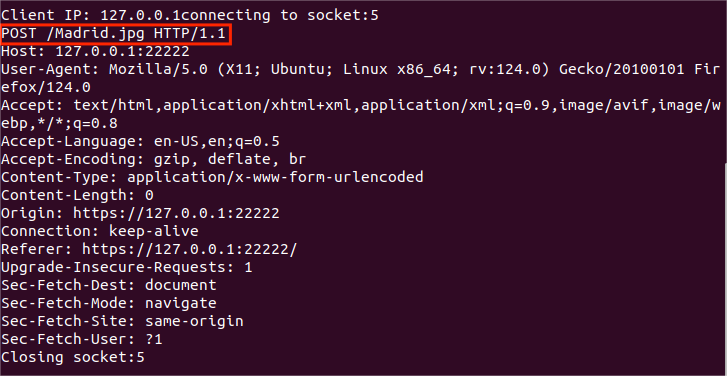

# 实验3：基于OpenSSL的安全WEB服务器实现


#### 学号：2112066

#### 姓名：于成俊

#### 专业：密码科学与技术


## 一、实验目的和要求

- Web使用的传输协议是HTTP协议。HTTP采用明文传输，网络传输中的重要数据有被第三方截获的危险。因此，为了保护敏感数据在传送过程中的安全，安全超文本传输协议（Hypertext Transfer Protocol over SSL，HTTPS）应运而生。HTTPS就是经过安全套接字协议层（Secure Socket Layer，SSL）加密后的HTTP，它可以与HTTP信息模型共存并容易与HTTP应用程序相整合。HTTPS使用SSL在发送方将原始数据进行加密，然后在接收方进行解密，加密和解密需要发送方和接收方通过交换共享密钥来实现，因此，所传送的数据不容易被截获和解密。

- 本章训练目的如下：

  ①理解HTTPS协议及SSL协议的工作原理。

  ②掌握使用OpenSSL编程的方法。

  ③提高网络安全系统设计的能力。

- 本章训练要求如下：

  ①运行于Linux平台。

  ②利用OpenSSL库编写一个Web服务器。

  ③实现HTTPS协议下最基本的GET命令功能。

  

## 二、实验内容

- 在Linux下利用OpenSSL实现安全的Web Server的具体要求如下：

  ①在理解HTTPS及SSL的工作原理后，实现安全的Web Server。

  ②Server能够并发处理多个请求，要求至少能支持Get命令。可以增强Web Server的功能，如支持Head、Post以及Delete命令等。

  ③书写必要的客户端测试程序用于发送HTTPS请求并显示返回结果，也可以使用一般的Web浏览器测试。


## 三、实验原理

### （1）SSL握手协议

SSL握手协议对SSL会话状态进行维护，为通信双方建立安全的传输通道，它是SSL协议中最复杂的部分。

当SSL客户端和服务器首次通信时，双方通过握手协议，协商通信协议版本号、选择密码算法、互相认证身份（可选），并使用公钥加密技术通过一系列的交换消息在客户端和服务器之间生成共享的秘密。双方根据这个秘密信息产生数据加密算法和HASH算法的参数等。

握手协议在应用层数据传输之前进行，包含一系列服务器与客户端的报文交换，这些报文都含有3个字段，即消息类型（1B）、消息长度（3B）、消息内容（不少于1B）。

下图描述了客户端和服务器建立连接时的报文交换过程，整个交换过程可以分为4个阶段。


- (1) **发起阶段**：

客户端发起client_hello类型的连接请求，其中包含的参数有客户端所支持的SSL协议的最高版本号、随机码、会话ID、密码套件（cipher suite，包括密钥交换算法和加密、认证算法）、压缩算法等，发出client_hello消息之后，客户端等待服务器的回应。服务器反馈server_hello类型的消息，其中版本字段是客户端和服务器都支持的最高版本号，另外还有一个与客户端相互独立的随机码，同时服务器还从客户端所提供的密码套件中确定后面所使用的密钥交换算法、加密/认证算法、压缩算法。

- (2) **服务器认证和密钥交换**：

服务器用certificate消息向客户端发送自己的证书，根据密钥交换算法的不同，server_key_exchange消息包含有该算法的相关参数。如果不允许匿名的客户端，则服务器发送certificate_request消息，会要求客户端提供证书。这一阶段的最后消息是server_done，这条消息表明服务器的相关报文已经发送完毕，接下来等待客户端的回应。

- (3) **客户端认证和密钥交换**：

收到服务器server_done类型的消息以后，客户端需要验证服务器提供的证书是合法的，并且server_hello所包含的参数是可行的。如果服务器需要客户端提供证书的话，客户端会用certificate消息向服务器发送证书。在client_key_exchange消息中，根据协商所确定的算法，客户端向服务器发送相应的参数信息。

- (4) **结束阶段**：

客户端和服务器分别向对方发送change_cipher_spec和finished类型的消息，至此握手的4个阶段全部结束，双方后续的通信全部采用协商确定的加密/认证算法和密钥进行。

### （2）BIO

BIO是Openssl库中重要的数据结构。无论即将建立的Openssl连接安全与否，Openssl都使用BIO抽象库(bio.h)来处理包括文件和套接字在内的各种类型的通信。一个BIO对象就是一个I/O接口的抽象，它隐藏了对于一个应用的许多底层I/O操作的细节工作。如果一个应用使用了BIO来进行I/O操作，它可以透明的处理SSL连接、加密连接和文件传输连接。

BIO分为两种类型，一种是Source/Sink类型，一种是Filter类型。前者代表数据源或数据目标，例如套接字BIO和文件BIO。后者的目的就是把数据从一个BIO转换到另外一个BIO或应用接口，在转换过程中，这些数据可以不经过修改就进行转换。例如在加密BIO中，如果进行写操作，数据就会被加密，如果是读操作，数据就会被解密。

**BIO的结构**如下：

```C++
typedef struct bio_st BIO;
struct bio_st
{
BIO_METHOD *method;  //BIO方法结构，决定BIO类型和行为的重要参数
/* bio, mode, argp, argi, argl, ret */
long (*callback)(struct bio_st *,int,const char *,int, long,long);  //BIO回调函数
char *cb_arg;  //回调函数都第一个参数
int init;  //初始化标识，已初始化则为1
int shutdown;  //开关标识，关闭为1
int flags; /* extra storage */
int retry_reason;
int num;
void *ptr;
struct bio_st *next_bio;  //Filter型BIO所用，代表BIO链的下一节
struct bio_st *prev_bio;  //Filter型BIO所用，代表BIO链的上一节
int references;
unsigned long num_read;  //读出的数据长度
unsigned long num_write;  //写入都数据长度
CRYPTO_EX_DATA ex_data;
};
```

### （3）HTTPS实现流程


## 四、实验环境

- 系统：Ubuntu 20.04.6 LTS
- 编程语言：C++


## 五、实验代码

### （1）初始化 OpenSSL 库

```c++
// 初始化 OpenSSL 库
void init_openssl() {
    // 加载OpenSSL将会用到的算法
    SSL_library_init();
    // 加载 SSL 错误信息    
    SSL_load_error_strings();
}
```

### （2）创建 SSL 上下文

```C++
// 创建 SSL 上下文
SSL_CTX* create_context() {
    // 使用 SSLv23 方法创建 SSL 上下文
    const SSL_METHOD* method = SSLv23_server_method();
    // 创建 SSL 上下文
    SSL_CTX* ctx = SSL_CTX_new(method);
    if (!ctx) {
        // 创建 SSL 上下文失败
        cerr << "Error creating SSL context" << endl;
        ERR_print_errors_fp(stderr); // 打印错误信息
        exit(EXIT_FAILURE); // 退出程序
    }
    return ctx;
}
```

### （3）密码回调函数

通过编写密码回调函数，可以实现自定义的密码获取逻辑。为后续设置密码回调函数做准备，OpenSSL 将在需要时调用回调函数以获取密码。

```C++
// 密码回调函数
int password_cb(char* buf, int size, int rwflag, void* userdata) {
    // 密码
    const char* password = "ycj6666";
    int len = strlen(password);

    // 将密码复制到缓冲区中
    strncpy(buf, password, len);
    return len;
}
```


### （4）配置SSL上下文

在配置SSL上下文之前需要生成**CA证书**和**服务器证书**，生成过程和方法已在第六部分进行展示。

```C++
// 配置 SSL 上下文
void configure_context(SSL_CTX* ctx) {
    // 设置密码回调函数
    SSL_CTX_set_default_passwd_cb(ctx, password_cb);
    // 设置 ECDH 自动选择曲线
    SSL_CTX_set_ecdh_auto(ctx, 1);

    // 加载证书和私钥
    if (SSL_CTX_use_certificate_file(ctx, "server.cer", SSL_FILETYPE_PEM) <= 0) {
        cerr << "Error loading certificate" << endl; // 加载证书失败
        exit(EXIT_FAILURE); // 退出程序
    }
    if (SSL_CTX_use_PrivateKey_file(ctx, "server.key", SSL_FILETYPE_PEM) <= 0) {
        cerr << "Error loading private key" << endl; // 加载私钥失败
        exit(EXIT_FAILURE); // 退出程序
    }
    SSL_CTX_load_verify_locations(ctx, "ca.cer", 0);// 加载受信任的CA证书
}
```

### （5）处理连接

#### 代码流程如下：

1. **创建SSL对象**：首先，从传入的参数中获取客户端的文件描述符和SSL上下文对象。然后，使用SSL上下文对象创建一个新的SSL对象。
2. **创建并设置BIO对象**：创建一个新的BIO对象，并将其与客户端的文件描述符关联。然后，将这个BIO对象设置为SSL对象的读取和写入BIO。
3. **SSL握手**：调用 `SSL_accept` 函数来进行SSL握手。如果握手失败，打印错误信息并退出。
4. **读取并处理请求**：读取客户端发送的请求，并根据请求的类型进行相应的处理。我们支持POST、HEAD和GET请求。对于**GET请求**，返回页面；对于**POST请求**，我们返回一个图片文件；对于**HEAD请求**，我们返回图片文件的日期信息。
5. **关闭连接**：最后，关闭SSL连接，释放SSL对象，并关闭socket连接。

```c++
//处理连接
void* handle_connection(void* args) {
    int client_fd = *((int**)args)[0];
    SSL_CTX* ctx = (SSL_CTX*)((void**)args)[1]; // 获取 SSL 上下文对象

    char buffer[BUFFER_SIZE];

    SSL* ssl = SSL_new(ctx); // 创建 SSL 对象
    // 创建 BIO 对象并将其与 SSL 对象关联
    BIO* bio = BIO_new_socket(client_fd, BIO_NOCLOSE);
    if (!bio) {
        perror("Error creating BIO object");
        SSL_free(ssl);
        close(client_fd);
        pthread_exit(NULL);
    }
    SSL_set_bio(ssl, bio, bio);

    if (SSL_accept(ssl) <= 0) { // SSL 握手
        ERR_print_errors_fp(stderr); // 打印错误信息
    }
    else {

        memset(buffer, 0, BUFFER_SIZE);
        SSL_read(ssl, buffer, BUFFER_SIZE); // 读取数据
        int len = strlen(buffer);
        if (len > 0 && buffer[len - 1] == '\n') {
            buffer[len - 1] = '\0';
        }

        cout  << buffer ; // 打印接收到的数据

        // 检查是否请求了 "Madrid.jpg"
        if (strstr(buffer, "POST /Madrid.jpg") != NULL) {
            // 打开图片文件
            FILE* file = fopen("Madrid.jpg", "rb");
            if (file != NULL) {
                // 获取文件大小
                fseek(file, 0, SEEK_END);
                long filesize = ftell(file);
                rewind(file);

                // 读取文件内容
                char* filedata = new char[filesize];
                fread(filedata, 1, filesize, file);
                fclose(file);

                // 创建 HTTP 响应
                char header[BUFFER_SIZE];
                sprintf(header, "HTTP/1.1 200 OK\r\nContent-Type: image/jpeg\r\nContent-Length: %ld\r\n\r\n", filesize);
                SSL_write(ssl, header, strlen(header)); // 发送响应头
                SSL_write(ssl, filedata, filesize); // 发送图片数据

                delete[] filedata;
            }
            else {
                const char* response = "HTTP/1.1 404 Not Found\r\nContent-Length: 0\r\n\r\n";
                SSL_write(ssl, response, strlen(response)); // 发送 404 响应
            }
        }
        else if (strstr(buffer, "HEAD /Madrid.jpg") != NULL) {
            // 处理 HEAD 请求
            struct stat attr;
            stat("Madrid.jpg", &attr);
            char date[50];
            strftime(date, 50, "%d.%m.%Y %H:%M:%S", localtime(&attr.st_mtime));

            char header[BUFFER_SIZE];
            sprintf(header, "HTTP/1.1 200 OK\r\nContent-Type: image/jpeg\r\nLast-Modified: %s\r\n\r\n", date);
            SSL_write(ssl, header, strlen(header)); // 发送响应头
        }
        else {
            const char* response = R"(
HTTP/1.1 200 OK
Content-Type: text/html

<!DOCTYPE html>
<html lang='en'>
<head>
    <meta charset='UTF-8'>
    <meta name='viewport' content='width=device-width, initial-scale=1.0'>
    <title>Hello, World!</title>
</head>
<body>
    <h1>Hello, World!</h1>
    <p>Welcome to our website!</p>
    <form method='POST' action='Madrid.jpg'>
        <input type='submit' value='Get Image'>
    </form>
    <button onclick='sendHeadRequest()'>Obtain the date of the image</button>
    <script>
        function sendHeadRequest() {
        var xhr = new XMLHttpRequest();
        xhr.open('HEAD', 'Madrid.jpg', true);
        xhr.onreadystatechange = function() {
            if (xhr.readyState == 4) {
                var lastModified = xhr.getResponseHeader('Last-Modified');
                document.getElementById('imageDate').innerText = 'Image date: ' + lastModified;
            }
        }
        xhr.send(null);
    }
    </script>
    <p id="imageDate"></p>
</body>
</html>


)";

            SSL_write(ssl, response, strlen(response)); // 发送 HTML 响应
        }
    }

    cout << "Closing socket:" << client_fd << endl << endl;
    SSL_shutdown(ssl); // 关闭 SSL 连接
    SSL_free(ssl); // 释放 SSL 对象
    close(client_fd); // 关闭 socket 连接
    pthread_exit(NULL);
}
```

- 为了实现通过**HEAD请求**获取图片日期，我使用 `stat` 函数来获取文件的修改日期，然后将这个日期添加到响应头中，我还用到了JavaScript代码，以便在收到服务器的响应后更新页面。我添加了一个新的 `<p>` 元素，用于显示图片的日期。注意，在C++中，`struct stat` 是用来获取文件属性的结构体，它定义在<sys/stat.h>头文件中。
- 注意，在C++中，原始字符串字面量（R"()"）不能包含未转义的双引号。这是因为编译器会将未转义的双引号解释为字符串的结束。所以，我使用单引号来代替了所有的双引号。这样，编译器就可以正确地解析这个字符串了。


### （6）main函数

在main函数中，首先需要调用函数来初始化OpenSSL、创建SSL上下文，之后创建socket，然后将其绑定到端口并监听连接，最后进入死循环，不断接受连接，为了实现**并发处理多个请求**，每接受一个客户端连接后，创建一个新的线程，由`handle_connection()`函数进行处理。

```c++
int main() {
    int server_fd, client_fd;
    struct sockaddr_in server_addr, client_addr;
    socklen_t client_len = sizeof(client_addr);
    SSL_CTX* ctx;

    // 初始化 OpenSSL
    init_openssl();

    // 创建 SSL 上下文
    ctx = create_context();

    // 配置 SSL 上下文
    configure_context(ctx);

    // 创建 socket
    server_fd = socket(AF_INET, SOCK_STREAM, 0); // 创建 TCP socket
    if (server_fd == -1) {
        perror("Error creating socket"); // 创建 socket 失败
        exit(EXIT_FAILURE); // 退出程序
    }

    // 绑定 socket 到端口
    server_addr.sin_family = AF_INET; // 设置地址族为 IPv4
    server_addr.sin_addr.s_addr = INADDR_ANY; // 设置 IP 地址为本地任意地址
    server_addr.sin_port = htons(SERVER_PORT); // 设置端口号
    if (bind(server_fd, (struct sockaddr*)&server_addr, sizeof(server_addr)) == -1) {
        perror("Error binding socket"); // 绑定 socket 失败
        exit(EXIT_FAILURE); // 退出程序
    }

    // 监听连接
    if (listen(server_fd, SOMAXCONN) == -1) {
        perror("Error listening on socket"); // 监听连接失败
        exit(EXIT_FAILURE); // 退出程序
    }

    cout << "------------------------- Server Starting ------------------------------" << endl;
    // 用于存储客户端IP地址的字符数组
    char client_ip[INET_ADDRSTRLEN];// INET_ADDRSTRLEN是IP地址字符串的最大长度
    // 接受连接并处理 HTTPS 请求
    while (1) {
        client_fd = accept(server_fd, (struct sockaddr*)&client_addr, &client_len); // 接受连接
        if (client_fd == -1) {
            perror("Error accepting connection"); // 接受连接失败
            continue; // 继续循环
        }
        // inet_ntop函数将网络地址结构转换为字符串形式
        inet_ntop(AF_INET, &(client_addr.sin_addr), client_ip, INET_ADDRSTRLEN);
        cout << "Client IP: " << client_ip << "connecting to socket:" << client_fd << endl;
        // 创建新线程处理连接
        pthread_t tid;
        // 将参数传递给线程函数
        void* args[2] = { &client_fd, ctx };

        if (pthread_create(&tid, NULL, handle_connection, args) != 0) {
            perror("Error creating thread");
            close(client_fd); // 关闭客户端连接
        }
    }


    // 清理工作
    close(server_fd); // 关闭服务器 socket
    SSL_CTX_free(ctx); // 释放 SSL 上下文
    ERR_free_strings(); // 清理 OpenSSL 错误信息
    EVP_cleanup(); // 清理 OpenSSL 加密库
    return 0;
}
```


## 六、实验结果展示

### （1）生成CA证书

- **创建CA证书私钥**：使用命令`openssl genrsa -aes256 -out ca.key 2048`

  

- **请求证书**：

  证数各参数含义如下：

  C-----国家（Country Name）
  ST----省份（State or Province Name）
  L----城市（Locality Name）
  O----公司（Organization Name）
  OU----部门（Organizational Unit Name）
  CN----产品名（Common Name）
  emailAddress----邮箱（Email Address）

  使用命令：`openssl req -new -sha256 -key ca.key -out ca.csr -subj "/C=CN/ST=SD/L=JN/O=QDZY/OU=www.test.com/CN=CA/emailAddress=admin@test.com"`

  

- **自签署证书**：使用命令：`openssl x509 -req -days 36500 -sha256 -extensions v3_ca -signkey ca.key -in ca.csr -out ca.cer`

  

### （2）生成服务器证书

- **创建服务器私钥**：使用命令：`openssl genrsa -aes256 -out server.key 2048`

  

- **请求证书**：使用命令：`openssl req -new -sha256 -key server.key -out server.csr -subj "/C=CN/ST=SD/L=JN/O=QDZY/OU=www.test.com/CN=SERVER/emailAddress=admin@test.com"`

  

- **使用CA证书签署服务器证书**：使用命令：`openssl x509 -req -days 36500 -sha256 -extensions v3_req  -CA  ca.cer -CAkey ca.key  -CAserial ca.srl  -CAcreateserial -in server.csr -out server.cer`

  

完成以上步骤，将出现下面7个文件：


### （3）运行服务器

- 使用命令 `g++ Server.cpp -o Server -lssl -lcrypto -pthread`进行编译，使用`./Server`命令运行服务器，如下：

  

- 使用Firefox浏览器，输入https://127.0.0.1:22222/进行访问，则会给服务器发送**GET请求**，来请求页面，日志如下：

  

- 页面如下：

  

- 点击Get Image按钮，则会给服务器发送**POST请求**，请求图片，日志如下：

  

- 页面如下：

  

- 点击初始页面的Obtain the date of the image按钮，会给服务器发送**HEAD请求**，来获取图片的修改日期，日志如下：

  

- 页面如下（日期显示在按钮底下）：

  

## 七 、实验拓展

- 四种请求：
  - **GET请求**：GET请求是最常用的HTTP方法，用于请求指定资源。GET请求应该只用于获取数据，而不应该改变服务器的状态。因为GET请求的参数包含在URL中，所以不适合发送敏感信息。
  - **POST请求**：POST请求用于向指定资源提交数据，这可能会导致服务器的状态发生变化。POST请求的数据包含在请求体中，所以可以发送大量数据，并且相对更安全。
  - **HEAD请求**：HEAD请求与GET请求类似，但服务器在响应中只返回头部信息，不返回实体的主体部分。这主要用于获取元信息，如获取资源的更新日期、类型等。
  - **DELETE请求**：DELETE请求用于删除指定的资源。成功的DELETE请求返回状态码202（已接受处理请求，但处理尚未完成），204（无内容，服务器成功处理了请求，但未返回内容）或200（OK，请求成功）。

- 由于我是在虚拟机上编程，想要连接网络，需要了解虚拟机的三种网络模式：

  - **桥接模式：**就是将主机网卡与虚拟的网卡利用虚拟网桥进行通信。类似于把物理主机虚拟为一个交换机，所有桥接设置的虚拟机连接到这个交换机的一个接口上，物理主机也同样插在这个交换机当中，所以所有桥接下的网卡与网卡都是交换模式的，相互可以访问而不干扰。在桥接模式下，虚拟机IP地址需要与主机在同一网段，如果需要联网，则网关与DNS需要与主机网卡一致。 

  - **NAT模式：**在NAT模式中，主机网卡直接与虚拟NAT设备相连，然后虚拟NAT设备与虚拟DHCP服务器一起连接在虚拟交换机VMnet8上，这样就实现了虚拟机联网。VMware Network Adapter VMnet8网卡是为了实现主机与虚拟机之间的通信。可见NAT模式下主机更像是虚拟机们的"路由器"，通过VMnet8虚拟网卡为虚拟机分发地址。所以虚拟机和主机不再同一网段下，可以理解为主机是虚拟机的"上级"，这也就是为什么桥接模式没有VMnet0这个虚拟网卡，因为桥接模式下的虚拟机和主机是"平等"的，共用同一个路由器。

  - **仅主机模式：**仅主机模式可有看成是NAT模式去除了虚拟NAT设备，然后使用VMware Network Adapter VMnet1虚拟网卡连接VMnet1虚拟交换机来与虚拟机通信的，Host-Only模式将虚拟机与外网隔开，使得虚拟机成为一个独立的系统，只与主机相互通讯。

    

## 八、实验总结

在这个实验中，我深入理解了HTTPS和SSL的工作原理，并使用OpenSSL库在Linux环境下实现了一个安全的Web服务器。这个服务器能够并发处理多个请求，并支持了GET、POST、HEAD等HTTP命令。

我首先创建了一个SSL上下文对象，并为每个客户端连接创建了一个新的SSL对象。然后，我使用BIO对象将SSL对象与socket关联起来，这样我就可以使用SSL_read和SSL_write函数来读取和写取数据了。

在处理客户端请求时，我检查了请求的类型，并根据请求的类型执行相应的操作。例如，对于POST请求，我会返回一个图片文件；对于HEAD请求，我会返回图片文件的日期信息。


## 九、实验感受

这个实验让我对HTTPS和SSL有了更深入的理解。我了解到，HTTPS不仅可以保护数据的隐私性，还可以保护数据的完整性，防止数据在传输过程中被篡改。此外，我也了解到SSL是如何通过握手过程来建立安全的连接的。

此外，这个实验也让我对HTTP协议有了更深入的理解。我了解到，HTTP协议定义了一系列的请求方法，如GET、POST、HEAD和DELETE等，这些方法可以让我们对网络资源进行各种操作。

总的来说，这个实验是一次非常有价值的学习经历。我不仅提高了自己的编程技能，还深化了自己对网络编程和网络安全的理解。我期待着在未来的学习和工作中应用这些知识和技能。

​              
